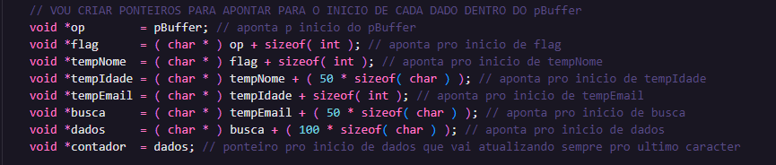
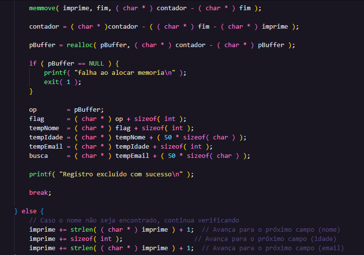
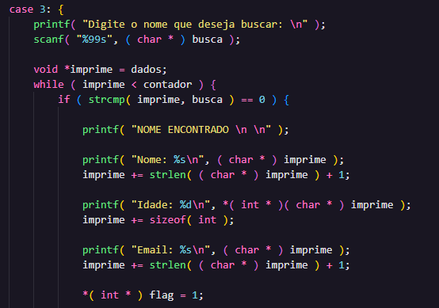
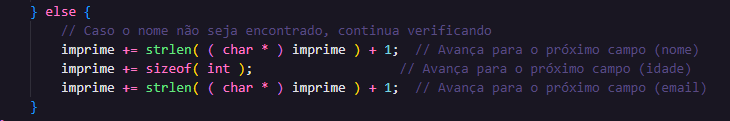
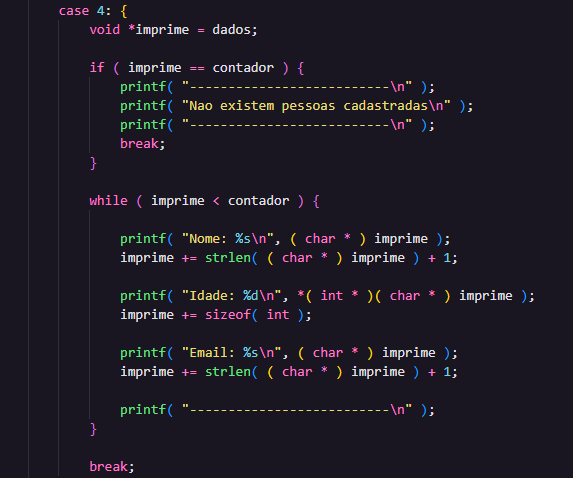
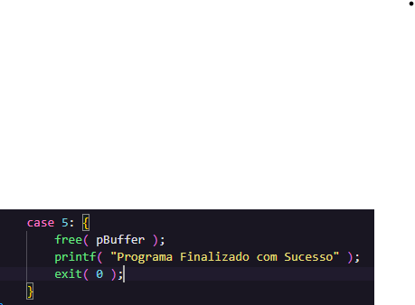

# Solução do Desafio da Agenda_pBuffer

## Informações Pessoais
- **Nome:** Nicolas Mattozo
- **Matrícula:** 23200570
- **Curso:** Ciência da Computação

- ## Organização dos Arquivos
1. `Agenda_pBuffer.c`: Este arquivo contém a versão final do código.

## Descrição do Problema
Faça uma agenda com o seguinte menu:
1- Adicionar Pessoa (Nome, Idade, email)
2- Remover Pessoa
3- Buscar Pessoa
4- Listar todos
5- Sair

O desafio é não poder criar variáveis e sim um buffer de memória (void *pBuffer). Nisso vocês terão que fazer o trabalho que o Sistema Operacional faz para vocês ao organizar a memória.

Regras:
Nenhuma variável pode ser declarada em todo o programa, somente ponteiros. Todos os dados do programa devem ser guardados dentro do pBuffer.
Nem mesmo como parâmetro de função. Só ponteiros que apontam para dentro do pBuffer.
Exemplo do que não pode: int c; char a; int v[10];  void Funcao(int parametro).
Não pode usar struct em todo o programa.

**Malloc:**

Utilizando Sizeof() foi feita a montagem do malloc para facilitar a aritmética de ponteiros.

**Ponteiros:**

Todos ponteiros sao inicializados usando o endereço de memória de pBuffer, sendo OP o primeiro valor do pBuffer e os endereços seguintes são calculados com base nos ponteiros anteriores.

 **Flag:**

A flag está presente em duas operações (Excluir Nome e Pesquisar Nome), ela serve apenas para alertar o usuario caso o nome digitado nao seja encontrado.

**Adicionar Pessoa:**

Os Dados são alocados em "variaveis" temporárias dentro do pBuffer.

Logo na sequencia temos o Realloc, que determina qual tamanho correto e ajustado do espaço de memória. Detalhe para o (contador - pBuffer) que após a primeira leitura, indica quantos espaços de memória o realloc deve realocar.

Os dados alocados nas "variaveis" temporárias, agora são movidos para o espaço já realocado e reservado para os dados através do memcpy, e o contador tambem é incrementado para apontar para o nome espaço disponivel para escrever um novo cadastro.

**Remover Pessoa:**

O nome a ser removido é lido e armazenado numa "varivel" temporária busca, após isso é inicado tres ponteiros:
Imprime = aponta para o inicio do espaço reservado para dados.
Inicio = vai apontar para o primeiro caracter do cadastro a ser excluido.
Fim = Aponta para o ultímo caracter do cadastro a ser excluido.

Após isso ele cria um while que, enquanto a posição inicial de Dados for menor que a posição final do pBuffer, ele vai seguir no loop.
Dentro desse while a cada nome lido acontece uma comparação para detectar se foi lido o nome digitado.

Nome Encontrado: ele lê todo cadastro, arruma os ponteiros de Inicio e Fim, cria um Novo ponteiro como auxiliar que aponta para Imprime.
Após isso ele move todos os dados existentes depois do final do cadastro a ser excluido para sobreescrever, logo é feito o realloc para ajustar novamente o tamanho do pBuffer, e o contador vai ser atualizado para receber o ultimo endereço de pBuffer.

Nome não Encontrado: ele roda todo cadastro, ativa a flag e avisa ao usuário que o nome não foi encontrado.

**Pesquisar Pessoa:**

O modo de busca é identico ao Remover Pessoa, sendo a uníca difença que ao achar o nome ele printa na tela.

**Mostrar Pessoas:**

O modo de Mostrar nome tambem é o mesmo, sendo a maior diferença que ele nao compara nome, printando todos os dados existentes dentro do pBuffer a partir do ponteiro de Dados.

**Sair:**

Apenas registra um Free em pBuffer e printa uma mensagem de despedida.

## Observações
- Por algum motivo desconhecido o código fica fora da formatação dentro do Git, porém nas IDEs ele funciona formatado corretamente.
