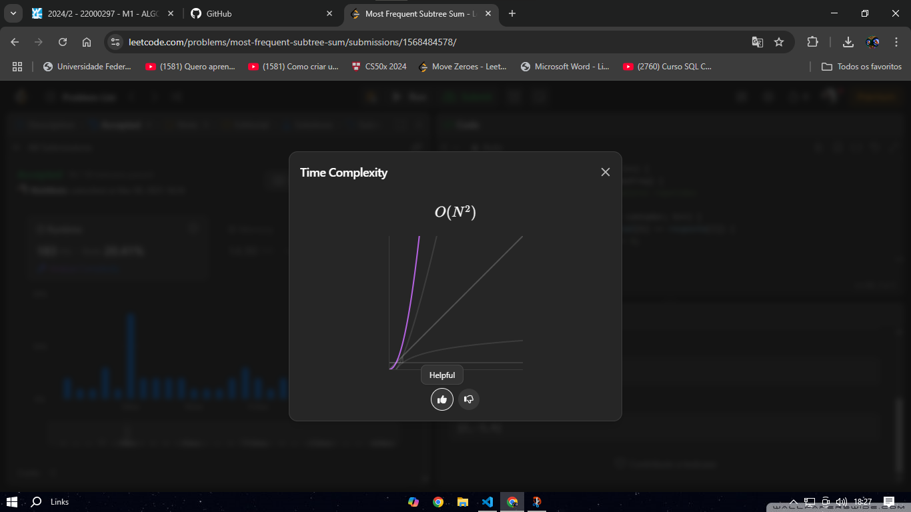

# Solução do Problema do LeetCode

**Nome do Problema:** most-frequent-subtree-sum

**Número do Problema:** 508

**Link para o Problema: [https://leetcode.com/problems/most-frequent-subtree-sum/]** 

## Informações Pessoais
- **Nome:** Nicolas Mattozo
- **Matrícula:** 23200570
- **Curso:** Ciência da Computação

- ## Organização dos Arquivos
1. `feito-em-aula.c`: Este arquivo contém a versão inicial do código, que não calculava a frequencia.
2. `feito-em-casa.c`: Este arquivo contém a versão quase certa do código, mas feita sem consulta.
3. `feito-em-casa-corrigido.c`: Este arquivo contém a versão 100% corrigida do código com auxilio de IA.

## Descrição do Problema
Dado o root de uma árvore binária, retorne a subárvore mais frequente sum . Se houver empate, retorne todos os valores com a frequência mais alta em qualquer ordem.

A soma da subárvore de um nó é definida como a soma de todos os valores do nó formados pela subárvore enraizada naquele nó (incluindo o próprio nó).

**Complexidade algorítmica**

O código feito apresenta complexidade O(N²)

**Percorrer os nodos**

Para percorrer a árvore pelos nós e realizar a soma foi utilizada a recursão

O modo feito em aula para percorrer a árvore foi o mesmo, porém ele apenas somava nós que tinham filhos a direita e a esquerda, tornando-se um limitador para a função

**Função Principal**

Inicio verificando se a árvore de fato existe, após isso aloco memória para um array chamada resposta e inicio meu index em 0 e chamo a função responsavel por somar os nós e alocar os mesmos dentro do array de resposta.
Após eu faço um laço para verificar a frequencia que uma soma aparece na árvore, e caso ela apareça o meu vetor de frequencia é incrementado com esse valor, e faço dentro de um if um teste para jogar o valor para a variavel que indica a frequencia mais alta

Esse laço percorre novamente meu index, agora para verificar se existe a incidencia do mesmo valor lido duas vezes, e é feito um if para verificar, caso seja lido a segunda vez ele da um break e sai do laço.

Esse main feito em aula apenas printava a soma sem verificar a frequência.

**Caso de Teste 1:**

**Caso de Teste 2:**

