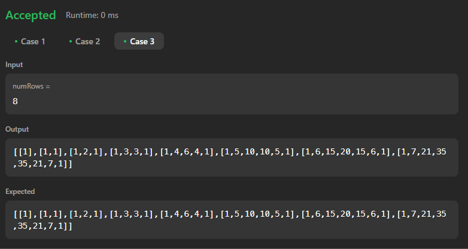

# Solução do Problema do LeetCode

**Nome do Problema:** pascals-triangle  

**Número do Problema:** 118

**Link para o Problema: https://leetcode.com/problems/pascals-triangle/** 

## Informações Pessoais
- **Nome:** Nicolas Mattozo
- **Matrícula:** 23200570
- **Curso:** Ciência da Computação

- ## Organização dos Arquivos
1. `pascal_com_erro.c`: Este arquivo contém a versão inicial do código, que apresentava um problema.
2. `pascal_corrigido.c`: Este arquivo contém a versão corrigida do código.

## Descrição do Problema
Dado um inteiro numRows, retorne o primeiro numRows do triângulo de Pascal .

No triângulo de Pascal , cada número é a soma dos dois números diretamente acima dele, conforme mostrado:

**Caso de Teste 1:**

**Caso de Teste 2:**

 **Caso de Teste 3:**

## Observações
- No arquivo `pascal_com_erro.c`, o problema estava na descrição do problema, que acabou não deixando claro qual seria a utilidade do returnColumnSizes e do returnSize, a lógica implementada estava parcialmente correta, porém não funcionaria devido a esses dois ponteiros de retorno, após entender o enunciado do problema e criar o ponteiro para um vetor de arrays, o problema foi resolvido.
- O erro foi corrigido no arquivo `pascal_corrigido.c`.

