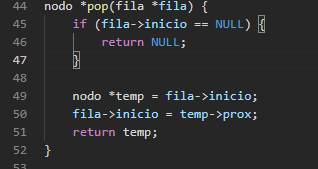

# Solução do LeetCode 1792

## Informações Pessoais
- **Nome:** Nicolas Mattozo
- **Matrícula:** 23200570
- **Curso:** Ciência da Computação

- ## Organização dos Arquivos
1. `src/main.c`: Este arquivo contém a versão final do código.
2. `src/error.c`: Este arquivo contém a versão feita em aula do código.

## Descrição do Problema
There is a school that has classes of students and each class will be having a final exam. You are given a 2D integer array classes, where classes[i] = [passi, totali]. You know beforehand that in the ith class, there are totali total students, but only passi number of students will pass the exam.

You are also given an integer extraStudents. There are another extraStudents brilliant students that are guaranteed to pass the exam of any class they are assigned to. You want to assign each of the extraStudents students to a class in a way that maximizes the average pass ratio across all the classes.

The pass ratio of a class is equal to the number of students of the class that will pass the exam divided by the total number of students of the class. The average pass ratio is the sum of pass ratios of all the classes divided by the number of the classes.

Return the maximum possible average pass ratio after assigning the extraStudents students. Answers within 10-5 of the actual answer will be accepted.

**Primeira Tentativa de Solução:**

Na primeira tentativa de solução, foi implementado uma lista, na qual armazenava todas as classes, após isso desempilhava elas de 2 em 2 calculando a média por classes, como visto abaixo:

Em um primeiro momento foi realizado o calculo completo das médias, calculando classe a classe e após somando todas elas e dividindo pelo numero de classes, porém ao implementar esse metodo, percebi que na verdade iria demorar MUITO para concluir o que foi pedido no exercicio, já que teria que, após calcular média de turma, procurar entre elas a menor para adicionar meu aluno "especial", o que alem de tempo de processamento faria eu escrever um código GIGANTESCO. A continuação desse código poderia ser finalizada, mas optei por mudar a abordagem para facilitar a explicação em vídeo.

**Estrutura de Dados:**

Foi Criado a estrutura padrão da Lista de Prioridade, onde a ordenação da lista acontece pela diferença nas médias, diferença essa que é calculada com base na diferença que um aluno a mais passando causaria na média, sendo a ordenação feita por quanto menor a diferença mais atras da fila fica a classe

**Manipulação da Função:**

Crio um loop para inserir os dados dentro da fila, armazeno numero de alunos que passou no exame e numero total de alunos para conseguir fazer a média de classe, e a partir dessa média eu consigo calcular qual a diferença de (média + 1) - média, e por esta conta eu obtenho o "peso"

**Relacionando extraStudents:**

Faço um loop com base no meu numero de extraStudents e a cada extraStudents eu tiro uma classe da fila e adiciono +1 aluno e +1 aluno aprovado, e após isso eu recalculo a diferença e só depois eu subo para minha lista a classe com a nova diferença

**Relacionando extraStudents:**

Crio um somátario, onde eu somo minhas classes e armazeno em média total, e após isso eu retorno a minha (média / numero de classes)

**TESTES:**

