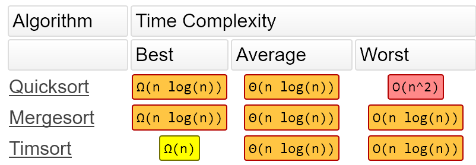
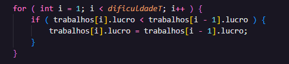
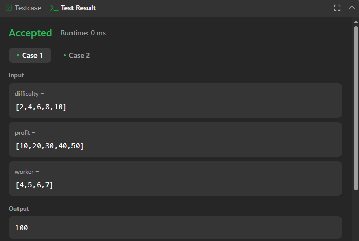

# Solução do Problema do LeetCode

**Nome do Problema:** most-profit-assigning-work

**Número do Problema:** 826

**Link para o Problema: [https://leetcode.com/problems/most-profit-assigning-work/]** 

## Informações Pessoais
- **Nome:** Nicolas Mattozo
- **Matrícula:** 23200570
- **Curso:** Ciência da Computação

- ## Organização dos Arquivos
1. `solucao.c`: Este arquivo contém a versão final e formatada no padrão DOOM 3 do código, feito 100% durante a aula.
2. `solucao-nao-formatada.c`: Esrte arquivo contém a versão final do código, feito 100% durante a aula.

## Descrição do Problema
Problema: Atribuição de Trabalhos com Lucro Máximo

Você tem n trabalhos e m trabalhadores. São fornecidos três arrays:

difficulty[i]: representa a dificuldade do trabalho i.

profit[i]: representa o lucro associado ao trabalho i.

worker[j]: representa a capacidade do trabalhador j (ou seja, o trabalhador só consegue realizar trabalhos com dificuldade menor ou igual a worker[j]).

Cada trabalhador pode ser designado para, no máximo, um trabalho, mas um mesmo trabalho pode ser realizado várias vezes por diferentes trabalhadores.

Exemplo de comportamento

Se três trabalhadores escolherem o mesmo trabalho que dá $1 de lucro, o lucro total será $3.

Se um trabalhador não tiver capacidade para realizar nenhum trabalho disponível, seu lucro será $0.

🎯 Objetivo: Retornar o lucro máximo total obtido ao atribuir os trabalhadores aos trabalhos de forma otimizada.

🔧 Restrições:

Cada trabalhador realiza no máximo um trabalho.

O mesmo trabalho pode ser repetido por vários trabalhadores.

O trabalhador só pode realizar trabalhos com dificuldade compatível com sua capacidade.

**Complexidade algorítmica**

O código feito apresenta complexidade O(N log N), pois o mesmo utiliza o qsort como método de ordenação da struct criada com intuito de armazenar os dados de lucro e dificuldade

**Criando Estrutura**

Pensando na forma de solucionar o problema foi criado uma estrutura para armazenar os dados que estavam relacionados (lucro e dificuldade)

**Inserção**

Após criar a estrutura foi declarado um vetor de estruturas e depois foi inserido todos os dados de dificuldade e lucro dentro da mesma, logo em seguida chamamos a função qsort que fica responsável por organizar em forma crescente os dados do vetor a partir da dificuldade

**Atualizar Valores**

Existe uma problemática não tão demonstrada nos exemplos que o problema nos apresenta, mas podemos ter um trabalho que tenha uma dificuldade N e um lucro N que é menor que o lucro de um trabalho de dificuldade menor, pensando nisso mesmo após a ordenação nós passamos novamente no vetor garantindo que, se o lucro da posição lida atualmente for menor que o da posição anterior, o valor da posição atual receberá o valor fda posição anterior

**Cálculo Final**

Nessa sequência de FOR eu finalmente pego apenas um trabalhador e acho qual é o melhor serviço (o que mais lucra) para ele, e após achar eu incremente o valor resposta e ao final retorno a resposta

**Caso de Teste 1:**

**Caso de Teste 2:**

